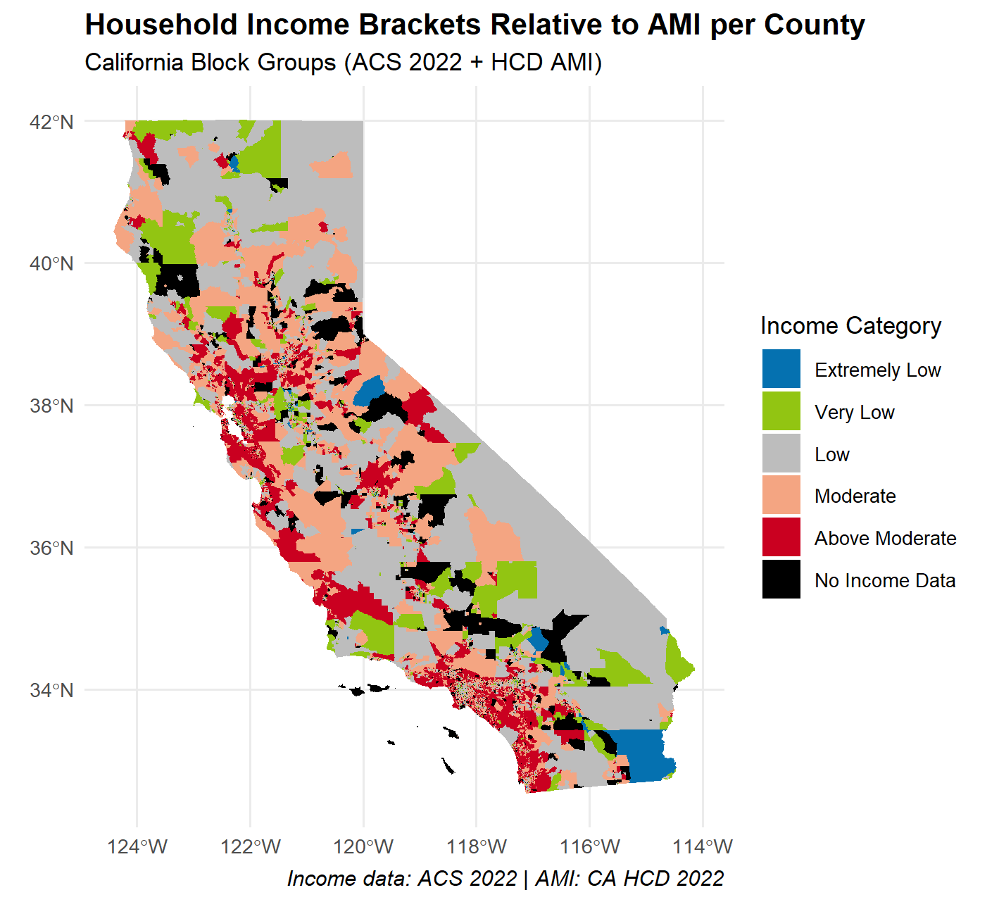

## SDM_Economical_Biases
This project aims to tailor economical biases into Species Distribution Models. Initially we continue off the work of DivShift_NAWC.

## DivShift - Observation ID & Human Footprint Index

Initially, the project will focus on California. The following images show the Observation ID Density on the left, which is to say, the places where most observations occur, and on the right, the human footprint index, which is to say people density. Data taken from DivShift_NAWC

## HCD Income brackets per block group

In order to better assess the economical bias, ACS data for each block group is taken from the most recent census (2018 - 2023) and
categorized into "Extremely Low", "Very Low", "Low", "Moderate", and "Above Moderate" as defined by The Department of Housing and Community Development (HCD). HCD publishes annual tables of official federal and State income limits for determining these maximums. In California there is a state Area Media Income (AMI), and a County Level AMI, and the latter is used to avoid over and under representing in households. 

The commonly used income categories are approximately as follows, subject to variations for household size and other factors:

- Acutely low income: 0-15% of AMI
- Extremely low income:  15-30% of AMI
- Very low income:  30% to 50% of AMI
- Lower income:  50% to 80% of AMI; the term may also be used to mean 0% to 80% of AMI
- Moderate income:  80% to 120% of AMI
