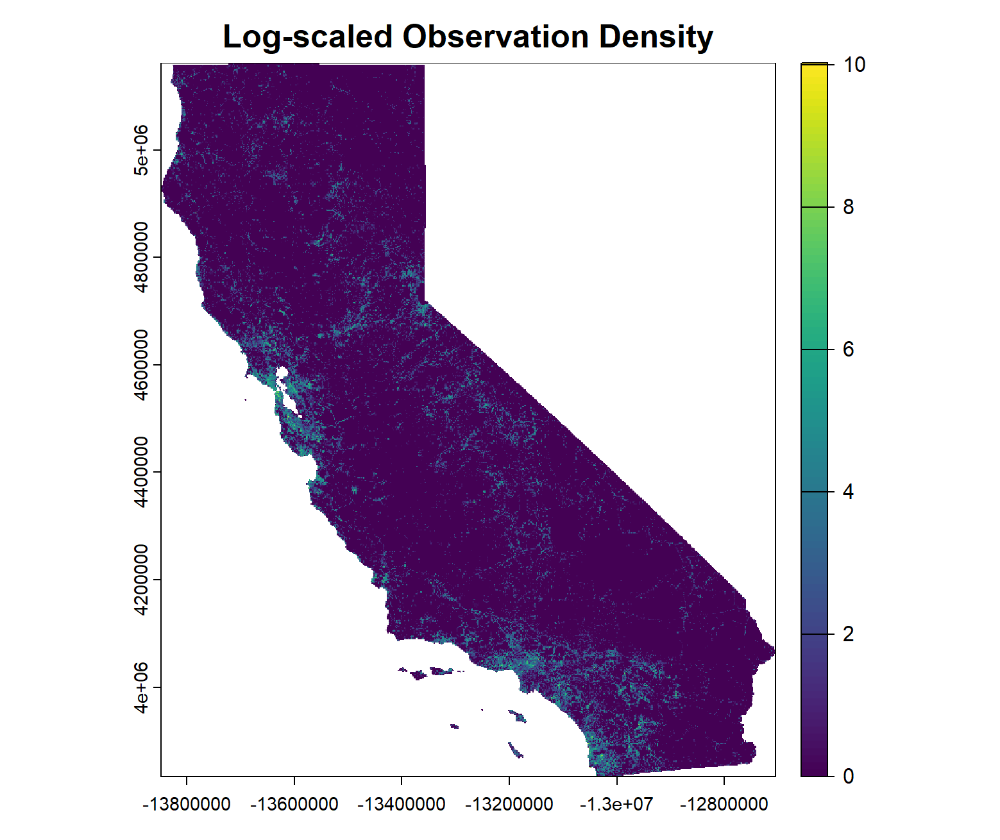
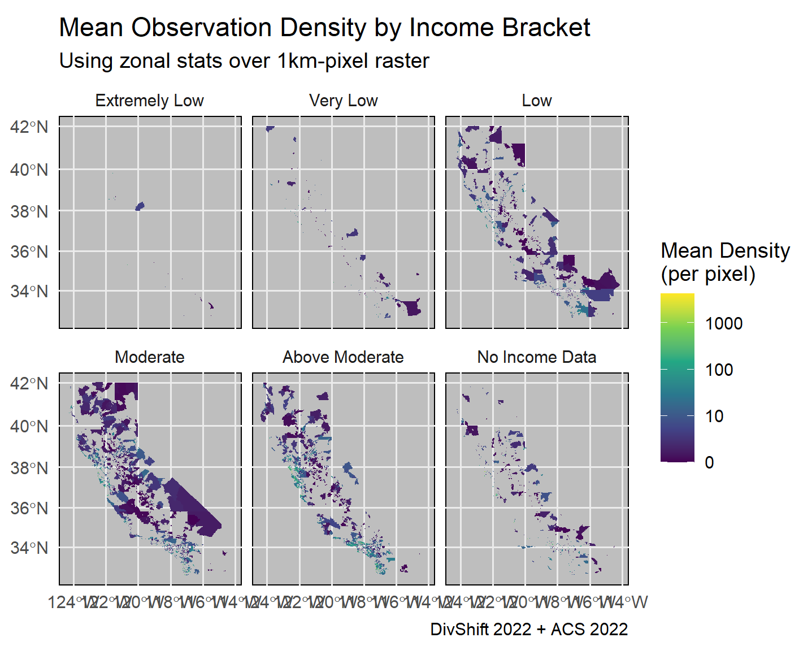
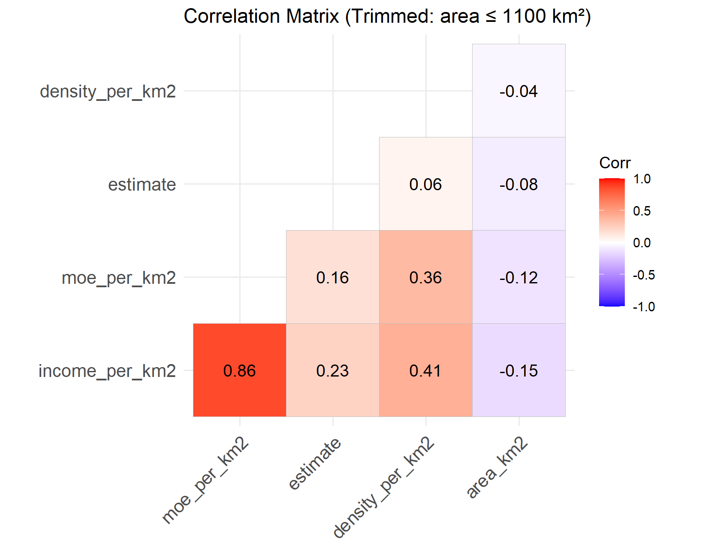

## SDM_Economical_Biases
This project aims to tailor economical biases into Species Distribution Models. Initially we continue off the work of DivShift_NAWC.

## DivShift - Observation ID & Human Footprint Index

Initially, the project will focus on California. The following images show the Observation ID Density on the left, which is to say, the places where most observations occur, and on the right, the human footprint index, which is to say people density. Data taken from DivShift_NAWC and processed using python.


## HCD Income brackets per block group

In order to better assess the economical bias, ACS data for each block group is taken from the most recent census (2018 - 2023) and categorized into

- "Extremely Low"
- "Very Low"
- "Low"
- "Moderate"
- "Above Moderate"

as defined by The Department of Housing and Community Development (HCD). HCD publishes annual tables of official federal and State income limits for determining these maximums. In California there is a state Area Media Income (AMI), and a County Level AMI, and the latter is used to avoid over and under representing in households. 


The commonly used income categories are approximately as follows, subject to variations for household size and other factors:

- Acutely low income: 0-15% of AMI
- Extremely low income:  15-30% of AMI
- Very low income:  30% to 50% of AMI
- Lower income:  50% to 80% of AMI; the term may also be used to mean 0% to 80% of AMI
- Moderate income:  80% to 120% of AMI

The DivShift data is loaded onto R, transformed into a raster and observations log transformed to avoid under-representation.



Finally, the observation data is joined to the income_data / classified_data. The data is used to visualize the relation between income block groups and observation density.



## Exploratory analysis

A statewide correlation matrix using raw income (estimate) with large-area block groups excluded (area ≤ 1100 km²).

| Variable | Definition | Calculation |
| -------- | | -------- | ----------- |
| `income_per_km2` | Total estimated income per square kilometer in a block group (normalizes income by area) | income_per_km2 = area_km2 / estimate |
| `moe_per_km2` | Margin of error (MOE) for income, scaled per square kilometer (The ACS-reported margin of error for the income estimate) | moe_per_km2= area_km2 / moe |
| `estimate` | Raw income estimate for the block group | Directly from ACS (B19013_001) |
| `density_per_km2` | Number of biodiversity observations per square kilometer (normalizes observation counts) | density_per_km2 = area_km2 / n_obs |
| `area_km2` | The total area of the census block group in square kilometers. | Derived from the geometry column in the spatial dataframe using: ```st_area() %>% units::set_units("km^2")``` |

### Transformation

- Log scaling (log1p): applied to handle skew and zeros (log(1+x)). 
- Outlier trimming: Analysis limited to block groups with area_km2 ≤ 1100



| Variable Pair | Correlation value | Meaning |
|-------------- | ----------------- | ------- |
| income_per_km2 & moe_per_km2 | 0.86 | Strong: areas with more income per km² also have more uncertainty per km² (likely due to urban heterogeneity) |
| income_per_km2 & estimate | 0.23 | Moderate: raw income and income density are related |
| income_per_km2 & density_per_km2 | 0.41 | moderate positive correlation between income concentration and observation density |
| estimate & density_per_km2 | 0.06 | Very weak: total income alone doesn’t explain where observations happen (spatial concenttation of income matters?) |
| area_km2 & all_other_vars | <0 | Larger areas tend to have lower density & income per km² |
