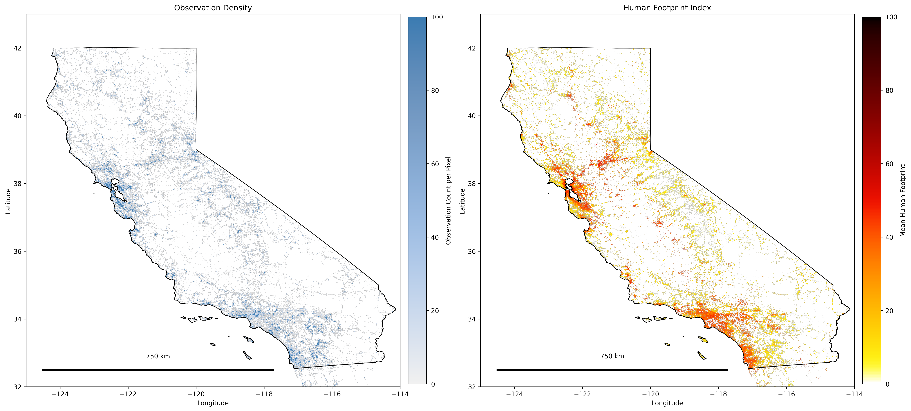

## SDM_Economical_Biases
This project aims to tailor economical biases into Species Distribution Models. Initially we continue off the work down on DivShift_NAWC.

Initially, the project will focus on California. The following images shows the Observation ID Density on the left, which is to say, the places where most observations occur, and on the right, the human footprint index, which is to say people density.

